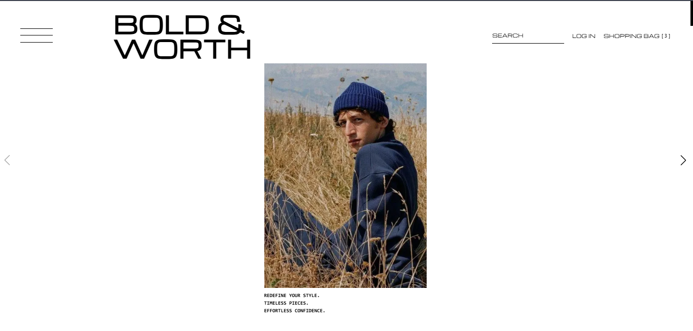
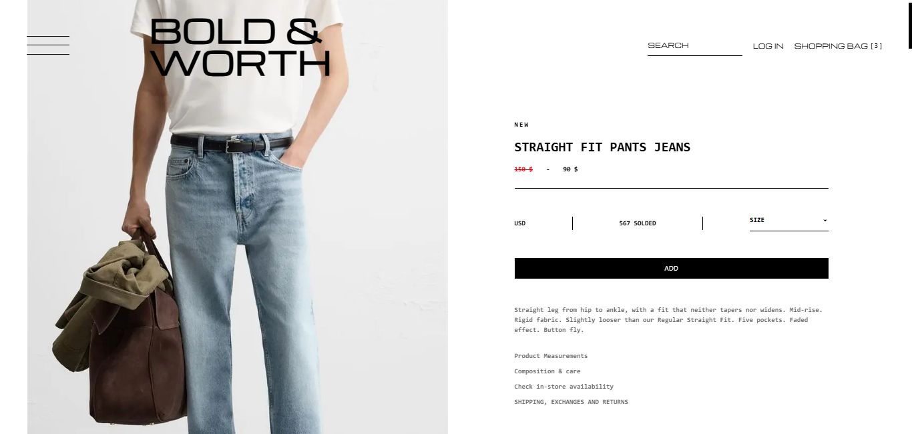
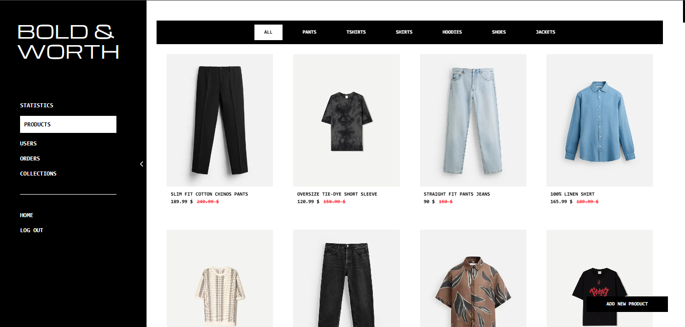

# 🛍️ Men's Fashion E-Commerce | Next.js + React

A modern **men’s fashion e-commerce platform** built with **Next.js** and **React.js**, focusing on clean architecture, reusability, and smooth UI animations.

---

## 🚀 Features

### 🧑‍💻 User Features
- 🔍 **Advanced search & filter** by product category.
- 🛒 Add or remove items from the shopping cart.
- ❤️ Personalized favorites list saved per user.
- 📄 Product detail pages with images, videos, and full data.
- 💳 Secure **checkout** page (only for logged-in users).
- 💰 Payment options:
  - Strapi integration
  - Cash on delivery
- 🧾 View current and previous orders.
- ✨ Beautiful UI animations using **AOS (Animate On Scroll)**.
- 🎥 Elegant visuals and product videos for a premium shopping experience.

---

### 🛠️ Admin Dashboard
- 📊 **Analytics Charts** showing:
  - Number of users
  - Active & pending orders
  - Total products & collections
- 🧩 **Product Management**:
  - Add, edit, delete, or mark items as “Sale” or “Best Seller”
  - Organize products into categories:
    - Pants
    - Jackets
    - Shirts
    - Hoodies
    - Shoes
- 👤 **User Management**:
  - View, block, or delete users
  - Access user orders and approve pending ones
  - Search users by username

---

## 🧩 Code Architecture
- ♻️ **Reusable components** for scalability and maintainability.  
- 🧠 **Modular structure**: each feature isolated for better readability and debugging.  
- ⚡ Optimized performance and clean code conventions.  
- 🎨 **Tailwind CSS utility classes** for fast and consistent styling.  

---

## 🧰 Tech Stack

| Technology | Purpose |
|-------------|----------|
| **HTML, CSS, JavaScript** | Core web structure |
| **React.js** | Component-based frontend |
| **Next.js** | SSR + API routes |
| **Redux Toolkit** | Global state management |
| **Tailwind CSS** | Styling framework |
| **Three.js** | 3D product models |
| **AOS** | Scroll-based animations |
| **Strapi** | Backend & payments |

---

🖼️ Project Preview :




🌟 Future Improvements :
⭐ Add product ratings & user reviews.
🏷️ Implement price-based filtering and sorting.
📱 Add push notifications for order updates.
🧾 Generate PDF invoices for completed orders.
🧠 Integrate AI-powered product recommendations.


🧠 Key Highlights : 
Clean, well-structured, and reusable codebase.
Smooth animations with AOS.
Real-time validation with smart feedback messages.
Toast notifications for all user actions.
Fully responsive across all devices.
Modern and elegant UI.


👨‍💻 Author : Mohamed Kamal
💼 LinkedIn : https://www.linkedin.com/in/mohamed-kamal-954aa0346?utm_source=share&utm_campaign=share_via&utm_content=profile&utm_medium=ios_app
📧 Email : mohamedjop0100@gmail.com

## ⚙️ Installation
```bash
# Clone the repository
git clone https://github.com/yourusername/mens-fashion-store.git

# Navigate to the project folder
cd mens-fashion-store

# Install dependencies
npm install

# Run the development server
npm run dev
